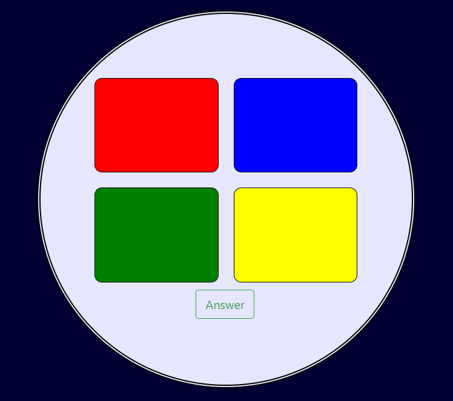

# Memory Game

### Gameplay
The idea of the game is to repeat a given sequence that grows by one after each turn. The longer the player goes the harder the game gets


## Bulding

#### Code used

The game interface was programmed using HTML 5 and styled with SCSS. Bootstrap 4.1.0 was used to help with the layour of the div elements. 

Javascipt was used to build the game gameplay along with Jquery 3.1.0.

### Logic

The game requires a random sequence to be generated that will get bigger after each turn. The radnom sequence will need to continue on from the previous sequence and not be a new one.

The game layout is 2 by 2 grid of four boxes each colored red blue green and yellow. EAch box is given an ID depending on its color.


    <div class="container main">
        <div class="row justify-content-center">
            <div class="box col-4 align-self-center" id="red-box"></div>
            <div class="box col-4 align-self-center" id="blue-box"></div>
            <div class="w-100"></div>
            <div class="box col-4 align-self-center" id="green-box"></div>
            <div class="box col-4 align-self-center" id="yellow-box"></div>
            <div class="w-100"></div>
        </div>




#### creating the sequence
In order to create the sequence an array called boxes was created 

*var boxes = ["red", "blue", "green", "yellow"];*

I also defined a varibale called i. These were used in a functoin called gamePlay which had a number of other functions within it. 
The first thing the function did was create a random number between 0 and 3 and applied this value to the variable i.
It then created a new variable selected which was defined as 

*var selected = "#" + boxes[i] + "-box"*

The code for the fucntion was

```javascript
    function gamePlay() {
        /*$(this).hide()*/
        i = Math.floor((Math.random() * 4));
        var selected = "#" + boxes[i] + "-box";

        function buildSequence() {
            sequence.push(selected);
        }
```

Therefore depening on what number was generated would define the value of selected.

*i=0 would return "#red-box"*

*i=1 would return "#blue-box"*

*i=2 would return "#green-box"*

*i=3 would return "#yellow-box"*

The next thing the function did was add this randomly generated item to a new array called "sequence". The more the fucntion runs the more randomly selected boxes will be added to our array called sequence.

#### Animation

Once the sequence was created the next thing we want to do is for the actual game to highlight the sequence to the user.
in order to do this a new fucntion was created called animates. Jquery was used in the coding as below

```javascript
    function animates(n) {
        $(sequence[n]).animate({ opacity: "0.5" }, "slow");
        $(sequence[n]).animate({ opacity: "1" }, "slow");
        n++;

        if (n <= sequence.length) {
            setTimeout(function() { animates(n); }, 2000);
        }
    }
```

The first piece of the code animates an intem from the array sequence with the index n. The fucntion will run while n increases by 1 until it is equal to the size of the array sequence.
Each box in our game is given an id in the html as

*"#red-box"*

*"#blue-box"*

*"#green-box"*

*"#yellow-box"*

As per the sequence builder, when a box is randomly selected it is added to the array sequence. Therefore the fucntion will animate each box with an ID matching to that in the sequence array and in the correct order untill all items in the array have been animated.
The animation is a simple change in opacity that shows the player which boxes are part of the sequence.

For example the build sequence function could build an array of **["#green-box", "#yellow-box", "#blue-box"]** and would therefore animate the same ids in thid order.

#### Playing the Game

The opening page of the game will just have one start button. Once this button is pressed the game begins.
The start button will run the two functions exaplined above, GamePlay and animate, as well as now show all the boxes and hide the start button. A new button will now appear called answer.
On the first go one box will be animated which will indicate to the player the first box in the sequence . The player is required to repeat the sequence and then click the answer button. If the answer is correct a message will appear advising the the palyer they can move on to the next sequence where two boxes will animate. If their selected sequence is incorrect then they will get a message advising the same and a new button to restart the game will appear.
The player can keep going until they are no longer able to repeat the sequence.

#### How the game compares the answer

In order to determine which box a user has selected a for loop was created

```javascript
    for (a = 0; a <= 3; a++) {
        $("#" + boxes[a] + "-box").click(function() {
            var clickedBox = "#" + this.id;
            answers.push(clickedBox);
            $(this).animate({ opacity: "0.5" }, "slow");
            $(this).animate({ opacity: "1" }, "slow");
        });
    }
```

The for loop starts at a = 0 and runs thru a = 1,2, and 3 so that each id will run the same code if it is clicked by the user.
Therefore if a person clicks the "#red-box" then the red box on the game will be animated and the id "#red-box" added to a new array called answers.

once the answer button is clicked the following code is run.

```javascript
    $("#answer-button").click(function() {
        for (y = 0; y < sequence.length; y++) {
            if (sequence[y] == answers[y]) {
                console.log("correct");
                $("#next-button").show();
                $("#correct-message").show();
                $("#answer-button").hide();
                $(".box").hide();
            }


            else {
                $(".box").hide();
                $("#lose-message").show();
                $("#correct-message").hide();
                $("#start-button").show();
                $("#answer-button").hide();
                $("#next-button").hide();

                for (var t = sequence.length; t > 0; t--) {
                    sequence.pop();
                    console.log(sequence);
                }
            }
        }
    });
```

The for loop is what compares the answer to the correct sequence. The if statment is asking the program to compare an item from array sequence to an item with the same index in array answer. 
Sequnnce array is built as per the random selected boxes and the answer array is built depening on what the user selects. Therefore the order of the arrays wil need to be the same for the answer to be correct.

The reason a for loop is used for this is becuase sequence and array will grow with each turn.

If the arrays match the correct message box will appear as well as a next button. When the next button is correct then gamePlay and animate functions will run only this time there will be a bigger sequence

If the arrays dont match the lose message will appear as well as the start button so the game can be played again. In ordet to make sure the game creates a new sequence a for loop has been added that empties the array called sequence.

After the comparison has been made a for loop will also run to empty the answer array. This means that the user will need to click each box again in the correct order so that answer array will build up again.

```javascript
        for (var t = answers.length; t > 0; t--) {
            answers.pop();
            console.log(answers);
        }
```